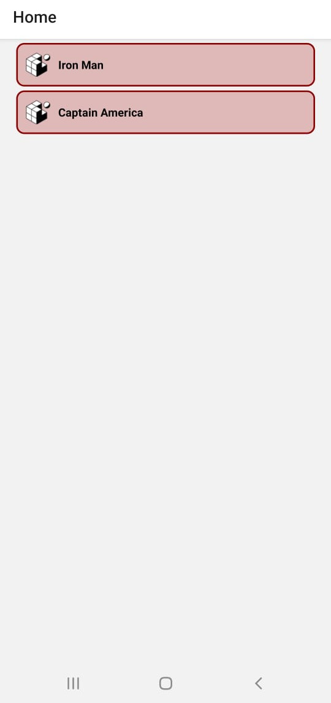
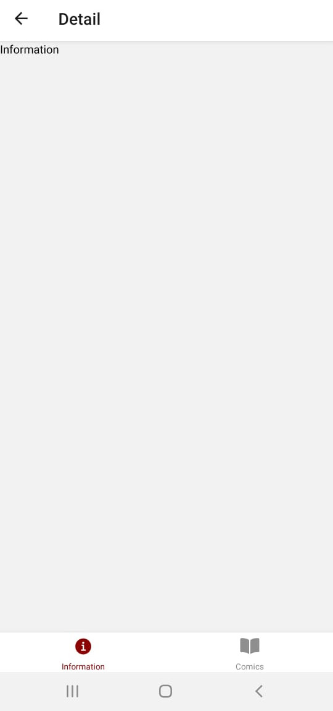
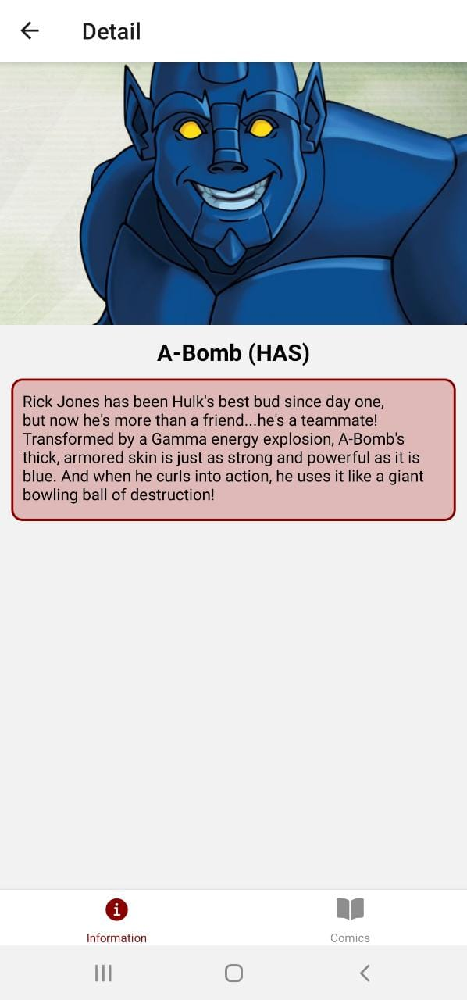
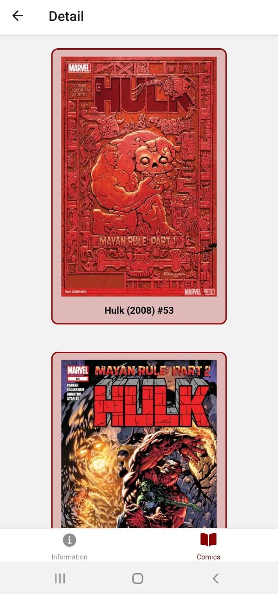
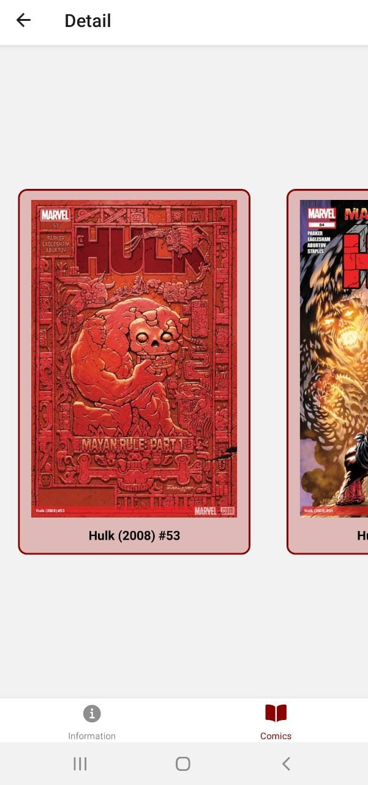
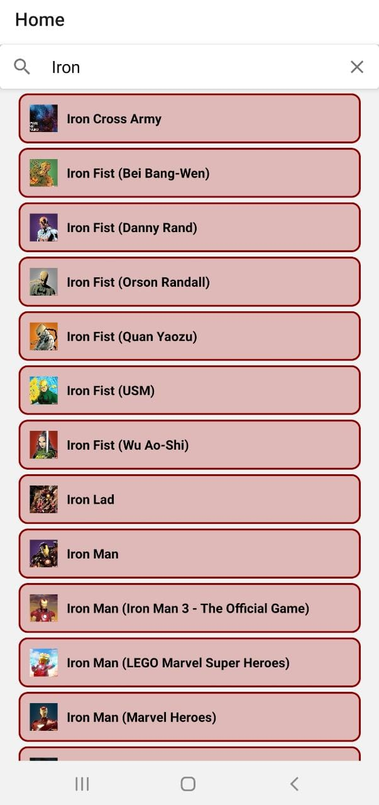

# Henry Workshop - React Native

## Overview

En este workshop vamos a crear una aplicación mobile utilizando React Native, para ello usaremos Expo para generar el boilerplate inicial y sobre el modificar lo necesario para elaborar la aplicación que se describirá a continuación.

## Setup Inicial

```bash
  // Instalamos expo-cli
  npm install -g expo-cli

  // Inicializamos un proyecto en este caso llamado MarvelApp
  expo init MarvelApp

  // Podemos ya probar su funcionamiento
  cd MarvelApp
  npm start
```

## Objetivo

La idea del workshop es crear una aplicación sobre Marvel en la cual se incluyan por lo menos las siguientes funcionalidades:

 - Poder mostrar un listado de personajes de Marvel (Incluyendo nombre y foto)
 - Poder filtrar el listado de personajes a partir de un input que ingrese el usuario y devuelva solo los personajes que comiencen con dicha palabra
 - Poder ir al detalle del personaje donde se deben poder seleccionar dos subpantallas:
    * Ver nuevamente el nombre y su foto pero también agregando la descripción 
    * Ver un listado de comics en los cuales aparece dicho personaje
- __EXTRA__: Hacer que el listado de personajes sea un scroll "infinito" que vaya cargando más personajes a medida que llegué al final de la lista
- __EXTRA__: Poder agregar/quitar personajes a una lista de favoritos


## Configuración API

Para poder obtener los resultados de los request a la API de Marvel vamos a necesitar contar con una API Key que la obtendremos creando una cuenta en https://developer.marvel.com/ y luego yendo a la sección "Get a Key", allí encontraran tanto una clave pública como una privada (Ambas serán necesarias).

La URL del request se formará de la siguiente forma:

http://gateway.marvel.com/v1/public/characters?ts={ts}&apikey={publicKey}&hash={md5Hash}

Donde:
 * ts: es un timestamp en el cual pueden ingresar cualquier valor, por ejemplo `henry` o tomar el timestamp de la fecha actual con `Date.now()`
 * publicKey: es la clave pública que les figura en la sección que recién mencionamos arriba
 * md5Hash: es un hash utilizando md5 y pasandole como inputs ts, privateKey y publicKey

Como siempre estos datos son sensibles por lo que lo recuerden no subirlos a su repositorio de código. Para evitar esto tienen que instalar como dependencia dentro del proyecto el módulo `react-native-dotenv`.

```bash
npm i react-native-dotenv
```

Adicionlamente deben agregar dentro del archivo `babel.config.js` una propiedad `plugins` quedando el archivo de la siguiente forma:

```js
module.exports = function(api) {
  api.cache(true);
  return {
    presets: ['babel-preset-expo'],
    plugins: [
      ["module:react-native-dotenv", {
        "moduleName": "@env",
        "path": ".env",
        "blacklist": null,
        "whitelist": null,
        "safe": false,
        "allowUndefined": true
      }]
    ]
  };
};
```

Esto les va a permitir utilizar cualquier variable definida dentro de un archivo `.env` que debe estar definido al mismo nivel del archivo de configuración de babel. En nuestro caso ustedes deberían definir las siguientes propiedades:

```
publicKey=...
privateKey=...
```

Luego podrán utilizarlas desde cualquier archivo del proyecto importándolas de la siguiente forma:

```js
import { publicKey, privateKey } from '@env';
```

A continuación les daremos una guía de como ir realizando la aplicación pero no es necesaria que la sigan tal cual se detalla o si prefieren hacer todo por su cuenta sin siquiera leerlo también es viable.

## Configuración de Screens

Comenzaremos pensando que pantallas vamos a tener para ya dejarlas configuradas y luego trabajar sobre cada una de ellas para implementar la parte visual de cada una. Basándonos en las imagenes ilustrativas brindadas más arriba nececsitaríamos las siguientes pantallas:

 * __Home__: contendrá la barra de búsqueda y el listado de personajes
 * __Detail__: cuando el usuario seleccione un personaje se deberá ingresar a esta pantalla con unos tabs inferiores para ir a switcheando entre `Perfil` y `Comcis`. Inicialmente se mostrará la primera.
 * __Perfil__: contendrá la información detallada del personaje seleccionado
 * __Comics__: contendrá un listado de comics en los cuales participa dicho personaje

*__Nota__: ya se encuentran instaladas las dependencias para la utilización tanto del Stack Navigator como del Tab Navigator, en el caso de que no utilicen este boilerplate recordan que deben instalarlos al igual que los módulos generales para React Navigation*

 ### Home Screen

Como vamos a querer que a partir del click en algun personaje listado en esta pantalla nos lleve a otra vamos a utilizar un Stack Navigator (Recuerden que deben ir instalando los módulos necesarios como se fue explicando durante el workshop):

```js
import * as React from 'react';
import { NavigationContainer } from '@react-navigation/native';
import { createStackNavigator } from '@react-navigation/stack';
import Home from './components/Home'

const Stack = createStackNavigator();

export default function App() {
  return (
    <NavigationContainer>
      <Stack.Navigator>
        <Stack.Screen name="Home" component={Home} />
      </Stack.Navigator>
    </NavigationContainer>
  );
}
```

Adicionalmente definiremos una carpeta `components` para ir guardando allí los componentes de React que vayamos a utilizar. En este caso necesitaremos definir el componente `Home` para utilizarlo dentro del Stack Navigator. Por ahora no nos vamos a preocupar por estilos.

### Componente Home

```js
import * as React from 'react';
import { Text, View } from 'react-native';

export default function Home() {
  return (
    <View style={{ flex: 1, alignItems: 'center', justifyContent: 'center' }}>
      <Text>Home Screen</Text>
    </View>
  );
}
```

### Componente CharacterCard

Por otro lado tenemos que tener algún componente que se relacione con cada uno de los personajes a mostrar en el listado dentro de `Home`. Debe ser un componente presentacional que muestre una imagen y un nombre, por lo que recibirá ambos datos por props y simplemente se encargará de darle estilos a los mismos (Los estilos quedan libres a su gusto):

```js
import * as React from 'react';
import { Text, View,  Image } from 'react-native';

export default function CharacterCard({image, name}) {
  return (
    <View style={styles.container}>
			<Image 
				style={styles.image}
				source={image}
			/>
      <Text style={styles.font}>{name}</Text>
    </View>
  );
}
```

Para probar si esta funcionando correctamente agregaremos dos `CharacterCard` desde el componente `Home`, luego esto será reemplazado cuando tengamos la llamada a la API con los datos reales.

```js
import * as React from 'react';
import { View } from 'react-native';
import CharacterCard from './CharacterCard';

export default function Home() {
  return (
    <View>
      <CharacterCard image={require('../assets/favicon.png')} name='Iron Man' />
      <CharacterCard image={require('../assets/favicon.png')} name='Captain America' />
    </View>
  );
}
```

<p align="center">
  
</p>

Ahora quisieramos que cuando se haga click en alguno de los personajes nos rediriga a la pantalla de `Detail` para eso tenemos que hacer uso del método `navigate` de la prop `navigation` que reciben todos los componentes.

El inconveniente que tenemos ahora es que `CharacterCard` no recibe de forma automática el objeto `navigation` como si lo hace `Home`. Por lo que tenemos dos posibles soluciones:

  1. Le pasamos la prop a `CharacterCard` desde `Home`
  2. Utilizamos el hook `useNavigation` en el componente `CharacterCard` para darle acceso al objeto `navigation`

Adicionalmente, el componente nativo `View` no dispone de un event listener `onPress` para detectar los touches por lo que vamos a cambiarlo por alguno de los Touchables que vimos antes (En particular en nuestra guia de ejemplo utilizaremos el `TouchableOpacity`).

```js
export default function Home() {
  return (
    <View>
      {/* Opcion 1 */}
      <CharacterCard {...props} image={require('../assets/favicon.png')} name='Iron Man' />
      <CharacterCard {...props} image={require('../assets/favicon.png')} name='Captain America' />

      {/* Opcion 2 */}
      <CharacterCard image={require('../assets/favicon.png')} name='Iron Man' />
      <CharacterCard image={require('../assets/favicon.png')} name='Captain America' />
    </View>
  );
}
```

```js
// Opcion 1
export default function CharacterCard({image, name, navigation}) {
  return (
    <TouchableOpacity 
			style={styles.container}
			onPress={() => navigation.navigate('Detail')}
	>
			<Image 
				style={styles.image}
				source={image}
			/>
      <Text style={styles.font}>{name}</Text>
    </TouchableOpacity>
  );
}

// Opcion 2
import { useNavigation } from '@react-navigation/native';

export default function CharacterCard({image, name}) {
	const navigation = useNavigation();
  return (
    <TouchableOpacity 
			style={styles.container}
			onPress={() => navigation.navigate('Detail')}
	>
			<Image 
				style={styles.image}
				source={image}
			/>
      <Text style={styles.font}>{name}</Text>
    </TouchableOpacity>
  );
}
```

### Detail Screen

Ahora nos falta crear la screen para los detalles del personaje ya que sino al hacer click no redirigirá a ninguna parte ya que no encontrará ninguna pantatlla que matchee con 'Detail'.

```js
import Detail from './components/Detail';

export default function App() {
  return (
    <NavigationContainer>
      <Stack.Navigator>
        <Stack.Screen name="Home" component={Home} />
        <Stack.Screen name="Detail" component={Detail} />
      </Stack.Navigator>
    </NavigationContainer>
  );
}
```

Y obviamente tenemos que crear nuestro componente `Detatils` que queremos que sea a su vez un nested navigator ya que queremos tener dos tabs en la parte inferior de este pantalla para poder switchear entre `Information` y `Comics`. Recuerden nuevamente que deben instalar el módulo para usar un Tab Navigator.

```js
import * as React from 'react';
import { createBottomTabNavigator } from '@react-navigation/bottom-tabs';
import MaterialCommunityIcons from 'react-native-vector-icons/Ionicons';

const Tab = createBottomTabNavigator();


export default function Detail() {
  return (
    <Tab.Navigator
      initialRouteName="Information"
      tabBarOptions={{
        activeTintColor: 'darkred'
      }}
    >
      <Tab.Screen 
        name="Information" 
        component={Information} 
        options={{
          tabBarIcon: ({ color, size }) => (
            <MaterialCommunityIcons name="information-circle" color={color} size={size} />
          )
        }}
      />
      <Tab.Screen 
        name="Comics" 
        component={Comics} 
        options={{
          tabBarIcon: ({ color, size }) => (
            <MaterialCommunityIcons name="book" color={color} size={size} />
          )
        }}
      />
    </Tab.Navigator>
  );
}
```

<p align="center">
  
</p>

Por el momento los componentes `Information` y `Comics` simplementen seran un `<View>` con un `<Text>`, más adelante volveremos sobre ellos para implementarlos bien. Por lo que por ahora habrá que simplemente crear dichos componentes en la carpeta components e importalos en `Detail`.

Si quieren cambiar los iconos del Tab Navigator pueden buscar el listado completo en https://ionic.io/ionicons o incluso pueden utilizar otros paquetes de íconos si prefieren.

### Obtener personajes desde la API

Empecemos a darle más forma a nuestra aplicación sacando los dos personajes hardcodeados que tenemos en `Home` y utilizando los que devuelva la API. En primer lugar vamos a probar si la conexión de la API es exitosa intentado hacer un request cuando el componente `Home` se monta.

Para ello vamos a utilizar `axios` y un paquete llamado `md5` para lograr el hash que nos pide la API de Marvel, nuevamente van a tener que instalarlos:

```bash
  npm install axios md5
```

Para mejor organizacion vamos a crear un archivo `config.js` dentro de la carpeta `MarvelApp` donde haremos la lógica del hash md5 para luego simplemente traer los valores en los componentes que tengan que hacer los request y usarlos. 

```js
import md5 from 'md5';
// Toma los valores de la clave pública y provada desde el archivo .env
import { publicKey, privateKey } from '@env';

const ts = Date.now();
// Generamos el hash que nos pide la API pasandole como parámetro 
// a la función md5 un string que concatene el ts + privateKey + publicKey
const hash = md5(`${ts}${privateKey}${publicKey}`);

// Exportamos un objeto con los datos necesarios para usar la API
// para que luego podamos importarlo desde cualquier componente
const apiParams = {
  ts,
  apikey: publicKey,
  hash,
	baseURL: 'https://gateway.marvel.com'
};
export default apiParams;
```

Ahora vamos a modificar el componente `Home` para que haga el request:

```js
import apiParams from '../config.js';
import axios from 'axios';

export default function Home() {
  const [isLoading, setLoading] = useState(true);
  const [data, setData] = useState([]);
  const { ts, apikey, hash, baseURL } = apiParams;

  useEffect(() => {
    axios.get(`${baseURL}/v1/public/characters`, {
      params: {
        ts,
        apikey,
        hash
      }
    })
      .then(response => setData(response.data.data.results))
      .catch(error => console.error(error))
      .finally(() => setLoading(false));
  }, []);

  return (
    <View>
      {isLoading 
        ? <ActivityIndicator size="large" color="#00ff00" /> 
        : (
          <FlatList
            data={data}
            keyExtractor={({ id }) => id.toString()}
            renderItem={({ item }) => (
              <CharacterCard 
                image={`${item?.thumbnail?.path}.${item?.thumbnail.extension}`} 
                name={item.name} />
            )}
          />
        )
      }
    </View>
  );
}
```

<p align="center">
  
</p>


### Obtener detalles de un personaje en particular

Ya teniendo la lista de personajes ahora enfoquémosnos en los detalles de uno de ellos en particular al hacerle click. Para esto vamos a necesitar hacer un request a `https://gateway.marvel.com/v1/public/characters/{characterId}`. Una vez obtenidos dichos datos deberíamos pasarselos al componentet `Information` (Mostraremos allí el nombre, la descripción y una imagen del personaje).

```js
export default function Home() {
  ...

  return (
    <View>
      {isLoading 
        ? <ActivityIndicator size="large" color="#00ff00" /> 
        : (
          <FlatList
            data={data}
            keyExtractor={({ id }) => id.toString()}
            renderItem={({ item }) => (
              <CharacterCard 
                id={item.id}
                image={`${item?.thumbnail?.path}.${item?.thumbnail.extension}`} 
                name={item.name} />
            )}
          />
        )
      }
    </View>
  );
}
```

```js
import React, { useState, useEffect } from 'react';
import { ActivityIndicator } from 'react-native';
import { createBottomTabNavigator } from '@react-navigation/bottom-tabs';
import MaterialCommunityIcons from 'react-native-vector-icons/Ionicons';
import Information from './Information';
import Comics from './Comics';
import apiParams from '../config.js';
import axios from 'axios';

const Tab = createBottomTabNavigator();

export default function Detail({ route }) {
  const [isLoading, setLoading] = useState(true);
  const [data, setData] = useState([]);
  const { ts, apikey, hash, baseURL } = apiParams;

  useEffect(() => {
    axios.get(`${baseURL}/v1/public/characters/${route.params.id}`, {
      params: {
        ts,
        apikey,
        hash
      }
    })
      .then(response => setData(response.data.data.results[0]))
      .catch(error => console.error(error))
      .finally(() => setLoading(false));
  }, []);

  return (
    <Tab.Navigator
      initialRouteName="Information"
      tabBarOptions={{
        activeTintColor: 'darkred'
      }}
    >
      <Tab.Screen 
        name="Information" 
        options={{
          tabBarIcon: ({ color, size }) => (
            <MaterialCommunityIcons name="information-circle" color={color} size={size} />
          )
        }}
      >
        {() => 
          (isLoading
            ? <ActivityIndicator size="large" color="#00ff00" /> 
            : <Information 
                image={`${data?.thumbnail?.path}.${data.thumbnail.extension}`}
                name={data.name}
                description={data.description} 
              />
          )
        }
      </Tab.Screen>
      <Tab.Screen 
        name="Comics" 
        component={Comics} 
        options={{
          tabBarIcon: ({ color, size }) => (
            <MaterialCommunityIcons name="book" color={color} size={size} />
          )
        }}
      />
    </Tab.Navigator>
  );
}
```

Ahora ya podemos hacer uso de las propiedades que pasa el componente `Detail` al componente `Information`:

```js
export default function Information({ image, name, description }) {
  return (
    <View style={styles.container}>
      <Image 
        style={styles.image}
        source={{uri: image}}
      />
      <Text style={styles.title}>{name}</Text>
      <Text style={styles.description}>{description}</Text>
    </View>
  )
}
```

<p align="center">
  
</p>

### Obtener comics de un personaje en particular

Nos falta completar la pantalla de comics por lo que podríamos pasarle como prop la lista de comics que si se fijan ya la obtenemos cuando hacemos el request para los detalles del personaje en `data.comics.items`. Por lo que vamos a pasarselo al componente `Comics` y luego allí crearemos otro componente `Comic` para renderizar cada uno de la lista.

```js
...
      <Tab.Screen 
        name="Comics" 
        options={{
          tabBarIcon: ({ color, size }) => (
            <MaterialCommunityIcons name="book" color={color} size={size} />
          )
        }}
      >
        {() => 
          (isLoading
            ? <ActivityIndicator size="large" color="#00ff00" /> 
            : <Comics
                listComics={data?.comics?.items} 
              />
          )
        }
      </Tab.Screen>
...
```

Ahora por cada elemento en `listComics` vamos a renderizar un componente `Comic`:

```js
import * as React from 'react';
import { View, Text } from 'react-native';
import Comic from './Comic';

export default function Comics({ listComics }) {
  return (
    <View>
      {
        listComics?.map(c => (
          <Comic name={c.name} />
        ))
      }
    </View>
  )
}
```

```js
import * as React from 'react';
import { View, Text } from 'react-native';

export default function Comic({ name }) {
  return (
    <View>
			<Text>{name}</Text>
    </View>
  )
}
```

¿No sería mucho más lindo tener las portadas de los comics y no solo su nombre? Bueno obtengamos esos datos entonces haciendo un request por cada comic a su `resourceURI`. Esto lo haremos desde `Comics` y a `Comic` simplemente le pasaremos el nombre y la imagen correspondiente para que lo renderice (Recuerden que cuando estamos agregando muchos componentes con la misma estructura debemos indicarle a react una key para que los pueda diferenciar, en este caso voy a usar el ID del comic):

```js
import React, { useState, useEffect } from 'react';
import { View, ActivityIndicator } from 'react-native';
import Comic from './Comic';
import apiParams from '../config.js';
import axios from 'axios';

export default function Comics({ listComics }) {
  const [isLoading, setLoading] = useState(true);
  const [data, setData] = useState([]);
  const { ts, apikey, hash, baseURL } = apiParams;

  useEffect(() => {
    const promisesArray = listComics.map(c => (
      axios.get(c.resourceURI, {
        params: {
          ts,
          apikey,
          hash
        }      
      })
    ));
    
    Promise.all(promisesArray)
      .then(responses => setData(responses.map(r => (
        r?.data?.data?.results[0]
      ))))
      .catch(error => console.error(error))
      .finally(() => setLoading(false));

  }, []);

  return (
    <View>
      {
        isLoading 
          ? <ActivityIndicator size="large" color="#00ff00" /> 
          : data.map(c => (
            <Comic 
              key={c.id}
              name={c.title} 
              image={`${c?.thumbnail?.path}.${c.thumbnail.extension}`}  
            />
          ))
      }
    </View>
  )
}
```

```js
export default function Comic({ name, image }) {
  return (
    <View>
			<Image
				source={{uri: image}}
			/>
			<Text>{name}</Text>
    </View>
  )
}
```

<p align="center">
  
</p>

Faltaría ahora cambiar la `<View>` por una `<ScrollView>` o una `<FlatList>` para poder deslizar para ver aquellos comics que no entran en pantalla. Pero para cambiar un poco vamos a intentar hacer que el scroll sea horizontal.

La idea es utilizar una `<FlatList>` similar a cuando lo hicimos con la pantalla `Home` pero ahora agregándole la propiedades `horizontal` que va a permitir que el scrolling sea horizontal.

```js
    <View style={{ flex: 1 }}>
      {
        isLoading 
          ? <ActivityIndicator size="large" color="#00ff00" /> 
          : <FlatList
              contentContainerStyle={{alignItems: 'center'}}
              data={data}
              keyExtractor={({ id }) => id.toString()}
              horizontal
              renderItem={({ item }) => (
                <Comic 
                  key={item.id}
                  name={item.title} 
                  image={`${item?.thumbnail?.path}.${item.thumbnail.extension}`}  
                />
          )}
        />
      }
    </View>
```

<p align="center">
  
</p>

Adicionalmente si prefieren que se vea un comic por "página" puede agregarle también la propiedad `pagingEnabled` a la `FlatList` y hacer que el componente `Comic` ocupe la totalidad de la pantalla.

### Input de búsqueda

De los requerimientos obligatorios para esta actividad nos estaría faltando poder buscar por nombre algún personaje, para ello vamos a necesitar primero agregar un input para que el usuario pueda escribir allí lo que desee buscar.

Para este punto vamos a utilizar un kit de UI, podemos elegir entre `React Native Elements` y `React Native Paper` que ya tienen algunos componentes desarrollamos y podemos utilizarlos como por ejemplo una `Searchbar`. Para poder usarlo debemos instalarl el que elijan:

```bash
// Para React Native Elements
npm install react-native-elements

// Para React Native Paper
npm install react-native-paper
```

En nuestro caso vamos a usar `React Native Paper` por lo que tendremos que importar el componente `Searchbar` dentro de `Home`:

```js
import { Searchbar } from 'react-native-paper';
```

Adicionalmente vamos a crear otro estado dentro de `Home` para mantener actualizado el valor escrito dentro de la `Searchbar`:

```js
const [search, setSearch] = useState('');
```

Luego lo utilizamos como cualquier otro componente, vamos a agregarlo dentro de la condición de que no este cargando (Recuerden que deben devolver un único elemento por lo que van a tener que agrupar la `Searchbar` y la `FlatList` en un contenedor):

```js
<Searchbar
  placeholder="Search for character..."
  onChangeText={value => setSearch(value)}
  value={search}
  onIconPress={searchCharacter}
  onSubmitEditing={searchCharacter}
/>
```

Algunas cuestiones a tener en cuenta sobre el codigo de arriba:
  * __onChangeText__: como el nombre lo indica va a ejecutar la función pasada como parámetro cuando el usuario escriba o borre algun caracter en la searchbar. En este caso simplemente estamos actualizando el valor del nuevo estado que acabamos de definir.
  * __onIconPress__: se va a ejecutar la función pasada como parámetro cuando el usuario haga click en el icono de la searchbar que en este caso dejamos el default que es una lupa
  * __onSubmitEditing__: se va a ejecutar la función pasada como parámetro cuando el usuario aprete desde el keyboard del celular el icono de búsqueda que es a su vez una lupa

  Lo único que nos quedaría ahora es definir la función `searchCharacter` que debería hacer el llamado correspondiente a la API y guardas los resultados en el estado `data` que ya teníamos de antes:

  ```js
    function searchCharacter() {
    if(search) {
      setLoading(true);
      axios.get(`${baseURL}/v1/public/characters`, {
        params: {
          ts,
          apikey,
          hash,
          nameStartsWith: search
        }
      })
        .then(response => setData(response.data.data.results))
        .catch(error => console.error(error))
        .finally(() => setLoading(false));
    }
  }
  ```

<p align="center">
  
</p>

### Extra Funcionalidades

Como bien se mencionó al comienzo del readme, la idea es que por su cuenta ahora intenten implementar las siguientes dos funcionalidades:

- Hacer que el listado de personajes sea un scroll "infinito" que vaya cargando más personajes a medida que llegué al final de la lista
- Poder agregar/quitar personajes a una lista de favoritos

Para el primer caso van a tener que investigar un poco sobre las propiedades de la `FlatList` y para el segundo caso lo ideal es que investiguen sobre cómo almacenar información en el dispositivo para que si cierran la aplicación y vuelven a abrirla más tarde puedan mantener el listado de favoritos.